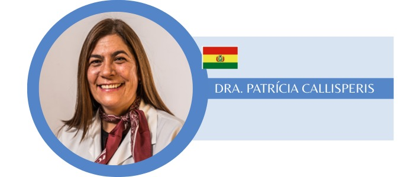

# 📸 CÓMO AGREGAR FOTOS DE LOS EXPOSITORES

## 📁 Estructura de Carpetas Creada

```
📁 Congreso Foro Cheq Firma/
├── 📁 images/
│   └── 📁 expositores/
│       ├── patricia-callisperis.jpg  ← AGREGAR AQUÍ
│       ├── edgar-rolon.jpg
│       ├── carmen-candia.jpg
│       ├── dannia-rios.jpg
│       ├── atilio-farina.jpg
│       ├── guillermo-rodriguez.jpg
│       ├── fernando-griffith.jpg
│       ├── edgar-villagra.jpg
│       ├── victor-villa.jpg
│       ├── juan-puerto.jpg
│       ├── julio-razona.jpg
│       ├── joseph-varon.jpg
│       ├── chinda-brandolino.jpg
│       └── placeholder.jpg
```

---

## 🎯 PASO A PASO - Agregar la foto de Dra. Patricia Callisperis

### **1. Guardar la Imagen:**

**Opción A - Si tienes la imagen en tu computadora:**
1. Localiza la imagen de la Dra. Patricia Callisperis
2. Cópiala a la carpeta: `images/expositores/`
3. Renómbrala como: **`patricia-callisperis.jpg`**

**Opción B - Si la imagen está en un navegador:**
1. Click derecho en la imagen
2. "Guardar imagen como..."
3. Guárdala en: `Congreso Foro Cheq Firma/images/expositores/`
4. Nombre: **`patricia-callisperis.jpg`**

---

## 📋 LISTA DE FOTOS NECESARIAS (15 Expositores)

Crea o guarda las fotos con estos nombres exactos:

### **Historiadores:**
- [ ] `edgar-rolon.jpg` - Prof. Edgar Rolón
- [ ] `carmen-candia.jpg` - Prof. Carmen Candia

### **Abogados:**
- [ ] `dannia-rios.jpg` - Abog. Dannia Rios Nacif
- [ ] `juan-puerto.jpg` - Abog. Juan Puerto
- [ ] `julio-razona.jpg` - Abog. Julio Razona

### **Médicos y Científicos:**
- [ ] `atilio-farina.jpg` - Dr. Atilio Fariña
- [ ] `guillermo-rodriguez.jpg` - Dr. Guillermo Rodríguez Dure
- [ ] `fernando-griffith.jpg` - Dr. Fernando Griffith
- [ ] `edgar-villagra.jpg` - Dr. Edgar Villagra
- [ ] `victor-villa.jpg` - Dr. Victor Villa
- [x] `patricia-callisperis.jpg` - Dra. Patrícia Callisperis ✅
- [ ] `joseph-varon.jpg` - Dr. Joseph Varón
- [ ] `chinda-brandolino.jpg` - Dra. Chinda Brandolino

---

## 📐 ESPECIFICACIONES TÉCNICAS DE LAS FOTOS

### **Formato Recomendado:**
- **Tipo:** JPG o PNG
- **Tamaño:** Cuadrado (1:1 ratio) - ideal 500x500px
- **Peso:** Máximo 500KB por imagen
- **Fondo:** Preferiblemente liso o profesional
- **Calidad:** Alta resolución pero optimizada para web

### **Características Ideales:**
✅ Foto profesional tipo perfil
✅ Fondo neutro o corporativo
✅ Rostro claramente visible
✅ Iluminación adecuada
✅ Imagen reciente

---

## 🔧 SI NO TIENES LA FOTO EN CUADRADO

### **Opción 1 - Usar herramienta online (GRATIS):**

1. Ve a: https://www.iloveimg.com/crop-image
2. Sube la imagen
3. Selecciona "Cuadrado" o "1:1"
4. Centra el rostro
5. Descarga

### **Opción 2 - En Windows (Paint):**

1. Abre la imagen con Paint
2. Click en "Cambiar tamaño"
3. Ajusta para que sea cuadrada (ej: 500x500)
4. Guarda como JPG

---

## ⚙️ CÓMO FUNCIONA EL SISTEMA

Una vez que agregues las fotos con los nombres correctos:

1. **Automáticamente se mostrarán** en la agenda
2. **Si NO hay foto**, se muestra el avatar con iniciales
3. **Si HAY foto**, se muestra la foto real
4. Las fotos se ven en formato circular profesional

---

## 🎨 EJEMPLO DE CÓDIGO (Ya está implementado)

```html
<!-- Si existe la foto, se muestra -->


<!-- Si NO existe, se muestra avatar con iniciales -->
<div class="speaker-avatar">PC</div>
```

---

## 🚀 ACTUALIZACIÓN AUTOMÁTICA

El sistema ya está configurado para:

✅ Buscar primero si existe la foto
✅ Si existe, mostrarla
✅ Si no existe, mostrar iniciales
✅ Aplicar estilos profesionales automáticamente

---

## 💡 TIPS PARA FOTOS PROFESIONALES

### **Si los expositores te envían sus fotos:**

1. **Solicitar:**
   - Foto profesional tipo perfil
   - Formato JPG o PNG
   - Fondo liso preferiblemente
   - Mínimo 500x500 píxeles

2. **Proceso:**
   - Recibir foto
   - Renombrar según lista
   - Guardar en `images/expositores/`
   - Refrescar página web

3. **Verificar:**
   - Que la foto se vea bien
   - Que esté centrada
   - Que sea del expositor correcto

---

## 📧 MENSAJE PARA PEDIR FOTOS A LOS EXPOSITORES

```
Estimado/a [Nombre del Expositor],

Para completar la información en nuestra página web del congreso, 
necesitamos una fotografía profesional suya.

Especificaciones:
- Formato: JPG o PNG
- Tamaño: Mínimo 500x500 píxeles (cuadrada)
- Tipo: Foto profesional tipo perfil
- Fondo: Preferiblemente liso o corporativo

Por favor envíenosla a: info@cheqfirma.com

¡Muchas gracias!
Equipo CheqFirma
```

---

## 🔍 VERIFICAR QUE LAS FOTOS FUNCIONAN

1. Agrega la foto en `images/expositores/`
2. Abre la página web (doble click en `ABRIR_PAGINA_WEB.bat`)
3. Ve a la sección "Agenda"
4. Busca al expositor
5. ¿Se ve la foto? ✅ Perfecto
6. ¿No se ve? Verifica:
   - Que el nombre del archivo sea exacto (con guiones)
   - Que esté en la carpeta correcta
   - Que el formato sea JPG o PNG

---

## 🎯 PRIORIDAD DE FOTOS

**Alta Prioridad (Más visibles):**
1. ✅ Dra. Patrícia Callisperis
2. Dr. Victor Villa (presentación principal)
3. Dr. Joseph Varón (tema importante)
4. Dra. Chinda Brandolino (cierre)

**Media Prioridad:**
- Todos los doctores
- Abogados con presentaciones

**Baja Prioridad:**
- Pueden ir agregándose progresivamente

---

## 🆘 SOLUCIÓN DE PROBLEMAS

### **La foto no aparece:**
- Verifica el nombre del archivo (debe ser exacto)
- Revisa que esté en `images/expositores/`
- Refresca el navegador (Ctrl + F5)

### **La foto se ve distorsionada:**
- Asegúrate que sea cuadrada (1:1 ratio)
- Usa las herramientas de recorte sugeridas

### **La foto pesa mucho:**
- Comprime en: https://tinypng.com/
- Reduce el tamaño a 500x500px máximo

---

## ✅ CHECKLIST

- [x] Carpeta `images/expositores/` creada
- [x] Sistema de fotos implementado en el código
- [x] Estilos CSS aplicados
- [ ] Agregar foto de patricia-callisperis.jpg
- [ ] Agregar fotos de los otros 14 expositores
- [ ] Verificar que todas se vean correctamente
- [ ] Optimizar peso de las imágenes

---

**🎉 ¡El sistema está listo! Solo falta agregar las fotos de los expositores.**

📍 **Ubicación:** `Congreso Foro Cheq Firma/images/expositores/`

💾 **Nombre actual:** Guarda la foto de la Dra. como: `patricia-callisperis.jpg`
